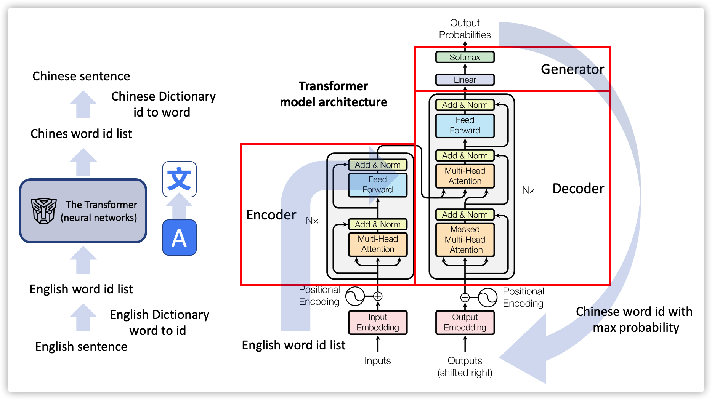

# Assignment: 

You are requseted to complete the code which builds an English-to-Chinese translator with PyTorth deep learning framework.



Check the jupyter notebook for details of the programming.
[Tutorial](Tutorial.ipynb)

## Python Environment (Miniconda)

- Python=3.12
- pytorch=2.5.1 (install torch and cuda verion which your computer supports)
- nltk=3.9.1
- numpy=1.26.3 (usually numpy is installed automatically with pytorch)
- matplotlib=3.10.0


To run the code, run the following command in your terminal or cmd window:
```python
python 
translator_en2cn.py
```# 作业要求：

本作业要求使用PyTorch深度学习框架完成一个英中翻译器的代码实现。


详细的编程说明请查看Jupyter笔记本：
[Tutorial](Tutorial.ipynb)

## Python环境（Miniconda）

- Python=3.12
- pytorch=2.5.1（安装torch和您电脑支持的cuda版本）
- nltk=3.9.1
- numpy=1.26.3（通常随pytorch自动安装）
- matplotlib=3.10.0

## 运行代码

在终端或命令窗口中运行以下命令：
```python
python translator_en2cn.py
```


